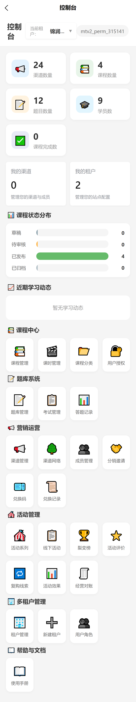
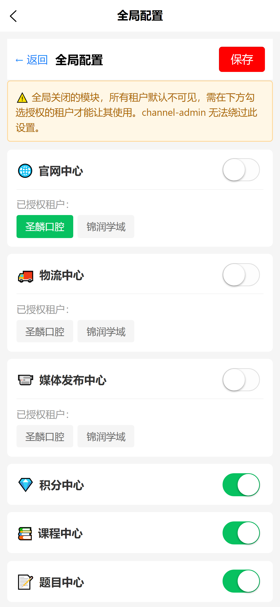
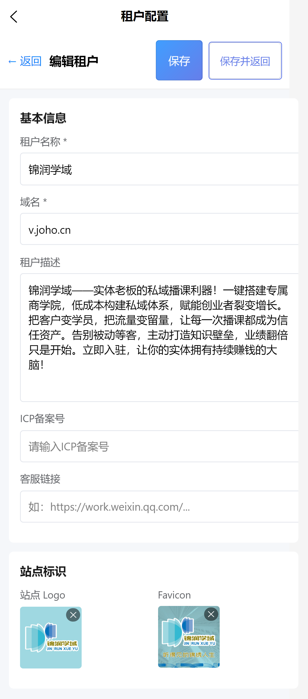

## 7. 权限设置

### 7.1 功能概述

权限设置用于管理系统用户可访问的功能模块和操作权限，包含两个入口：

| 模块 | 位置 | 说明 |
|------|------|------|
| 系统权限 | 首页面板「⚙️ 系统设置」→「权限管理」 | 按角色配置功能权限，采用角色-权限树模型 |
| 渠道权限 | 首页面板「⚙️ 系统设置」→「渠道权限」 | 为具体用户分配/撤销渠道访问范围 |

> **导航说明**：本系统为移动端面板布局，**没有左侧菜单**。所有功能都从「首页面板」（工作台）进入——先在首页面板找到对应功能分区（如「⚙️ 系统设置」「🏢 多租户管理」「📝 题库系统」），再点击分区下的具体功能卡片。在功能页内如需切换到其他功能，点击顶部返回键回到首页面板后重新进入。

权限模型说明：

- 系统基于 **角色（Role）** 授权，用户绑定角色后自动继承该角色的全部权限。
- 权限点采用「菜单 / 按钮」两级粒度，支持按功能模块精细控制。
- 渠道权限独立于角色权限，用于限定用户可访问的渠道范围。
- 管理员（系统管理员）默认拥有全部权限。

### 7.1.1 功能模块显示的三层判定

一个功能模块（如积分中心、课程中心、官网中心）能否显示，需同时满足以下条件，**缺一不可**：

1. **全局功能开关**：模块在「全局配置」中被全局开启，或已为该租户单独开通；
2. **租户开通**：当前租户被授权使用该模块（全局关闭时生效）；
3. **角色可见性**：当前用户角色属于该模块的可见角色列表（配合系统权限里的角色授权）。

> 即：**全局开关打开 + 用户有权限 → 模块显示**。三者任一不满足则不显示。
>
> **租户是否允许开通某个功能模块，只有管理员有权限配置**，普通用户直接继承租户开通结果开展业务，无法自行设置。

### 7.1.2 跨租户同一用户显示差异实例

同一用户在不同租户下，因租户开通情况不同，显示内容不同。以官网中心模块为例（圣麟口腔开启、锦润学域未开启）：

- 切换到 **圣麟口腔**：首页面板显示「🌐 官网中心」分区。
- 切换到 **锦润学域**：首页面板隐藏「🌐 官网中心」分区。

> 切换租户后系统按新租户的开通配置重新计算模块显示，刷新页面后差异立即生效。

### 7.2 系统权限管理

用于按角色勾选菜单和按钮权限，修改后需保存生效。

**操作步骤**：

1. 返回首页面板，在「⚙️ 系统设置」分区点击「权限管理」
2. 在顶部角色标签栏中选择要配置的角色（如：讲师、课程管理员、普通用户等）
3. 展开权限树，勾选/取消勾选相应权限节点
4. 点击底部「保存权限配置」按钮，提示「保存成功」即生效

**权限树结构**：

权限树按功能模块分组（认证权限、课程中心、学习数据、题库系统、积分体系、营销运营、系统工具、标签体系、直播工作室、官网中心、物流中心、理财中心、优惠券分销、追踪、认证授权），每个分组下按层级展示：

| 层级 | 说明 | 示例 |
|------|------|------|
| 一级节点 | 功能分组（菜单） | 课程中心 |
| 二级节点 | 功能菜单或按钮 | 课程管理、课程创建 |
| 三级节点 | 按钮/细粒度权限 | 课程发布、课程编辑 |

**节点勾选规则**：

- 勾选某节点时，会 **自动勾选其全部子节点以及祖先节点**（父节点联动）。
- 取消勾选某节点时，会 **一并取消其全部子节点**。
- 父节点下仅部分子节点被勾选时，显示「半选」状态（`-`）。
- 若误操作，可在保存前再次点击节点恢复原状态；已保存的修改可重新进入页面调整。

> **注意**：保存后权限立即生效。被取消权限的角色用户，刷新页面后对应功能分区和操作会隐藏，无权限的操作会返回 403。请谨慎修改管理员角色。

### 7.3 渠道权限管理

用于为具体用户分配可访问的渠道，以及查看/撤销已有分配。

**操作步骤（分配渠道）**：

1. 返回首页面板，在「⚙️ 系统设置」分区点击「渠道权限」
2. 点击右上角「+ 分配渠道」按钮
3. 在弹窗中填写：
   - **用户 ID**（必填）：目标用户的数字 ID
   - **渠道**（必填）：从下拉列表选择要分配的渠道
4. 点击「确认分配」，提示「分配成功」后列表刷新，该用户卡片显示已分配的渠道标签

**查看与搜索**：

- 页面以用户卡片形式展示所有已分配渠道的用户，卡片中显示用户名、邮箱及已分配的渠道标签。
- 顶部搜索框支持按「用户名/邮箱」关键词搜索后点击「搜索」过滤。
- 若尚未分配任何渠道，页面显示「暂无用户渠道数据」空状态。

**撤销渠道**：

1. 在用户卡片中找到要撤销的渠道标签
2. 点击渠道标签右侧的「✕」
3. 在确认弹窗中点击「确定」，提示「已撤销」后列表刷新

> **注意**：撤销后该用户立即失去对对应渠道的访问权限，请确认后再操作。

### 7.4 功能模块开通（仅管理员）

用于配置各功能模块的全局开关，以及为指定租户单独开通某一个模块。该配置**只有管理员有权限操作**，普通用户无法更改，直接继承租户的开通结果。

**两个配置入口（编辑同一份数据）：**

| 入口 | 位置 | 用途 |
|------|------|------|
| 全局视角 | 首页面板「🏢 多租户管理」→「租户权限」 | 查看所有模块的全局开关，全局关闭时可批量勾选授权租户 |
| 租户视角 | 首页面板「🏢 多租户管理」→「租户管理」→ 目标租户 →「功能模块开通」 | 针对某一个租户单独开通模块 |

**7.4.1 全局配置**

1. 返回首页面板，在「🏢 多租户管理」分区点击「租户权限」。
2. 每个模块卡片第一行为全局开关：开启表示该模块对所有租户开放；关闭表示默认隐藏。
3. 关闭后，卡片下方出现「已授权租户」网格，逐个勾选需要开通该模块的租户。
4. 点击右上角「保存」。

**7.4.2 租户详情开通**

1. 返回首页面板，在「🏢 多租户管理」分区点击「租户管理」。
2. 点击进入目标租户详情。
3. 下拉到「功能模块开通」区块。
4. 已全局开启的模块显示「🔓 全局已开」且开关禁用；其余模块可逐一切换「未开通/已开通」。
5. 点击「保存功能模块开通」。

> **生效说明**：保存后自动清空配置缓存，用户切换租户或刷新页面后按新配置判定模块显示。

### 7.5 常见问题与错误提示

| 问题 | 原因 | 解决方案 |
|------|------|----------|
| 保存权限配置提示失败 | 网络异常或权限不足 | 检查网络连接；确认当前账号为管理员角色 |
| 修改后对方权限未变化 | 未点击「保存权限配置」 | 勾选后必须点击保存，提示「保存成功」才生效 |
| 找不到某个权限节点 | 权限树默认折叠 | 点击一级节点展开下级；使用搜索或逐个展开查找 |
| 分配渠道提示失败 | 用户 ID 不存在或渠道未选择 | 确认用户 ID 正确；确认已选择渠道 |
| 撤销渠道无效 | 未确认弹窗 | 撤销时必须在确认弹窗点击「确定」 |

---
