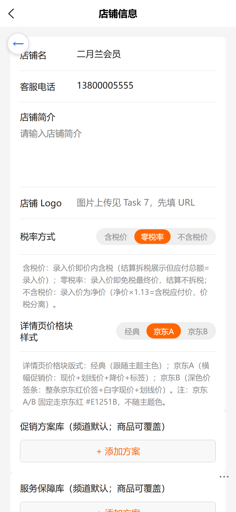
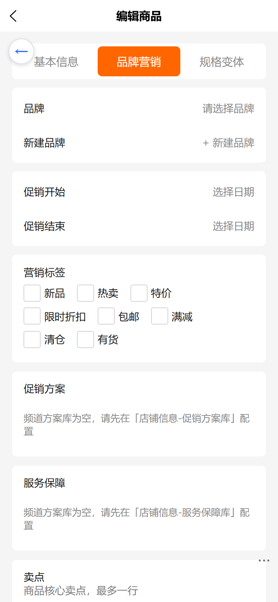
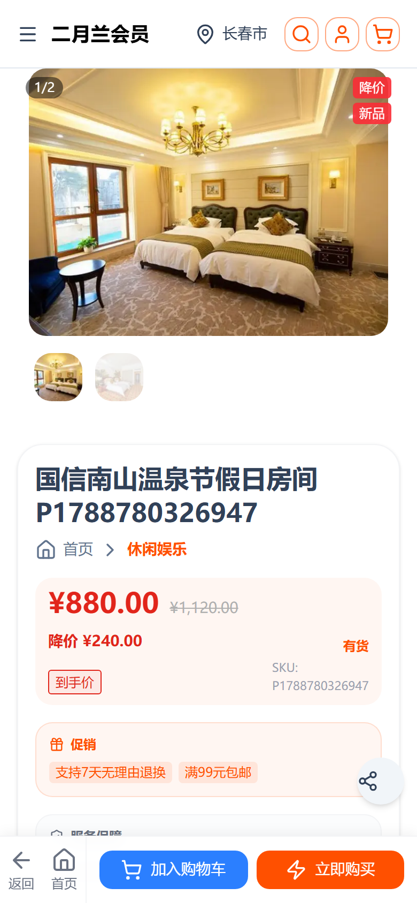
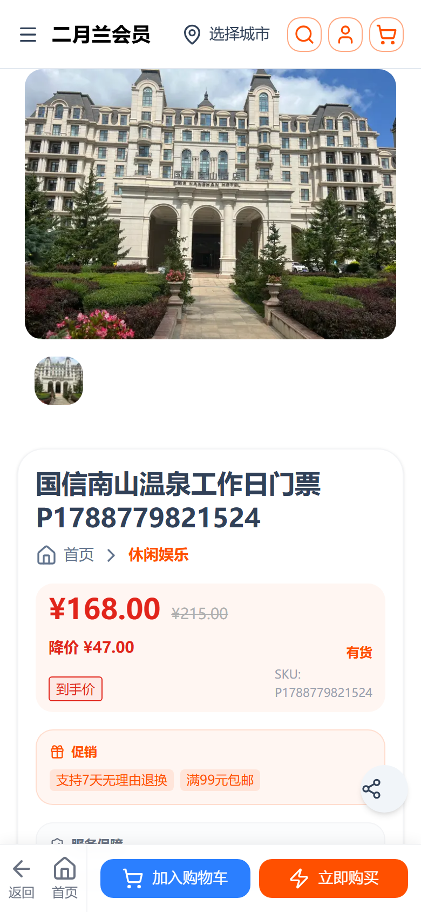
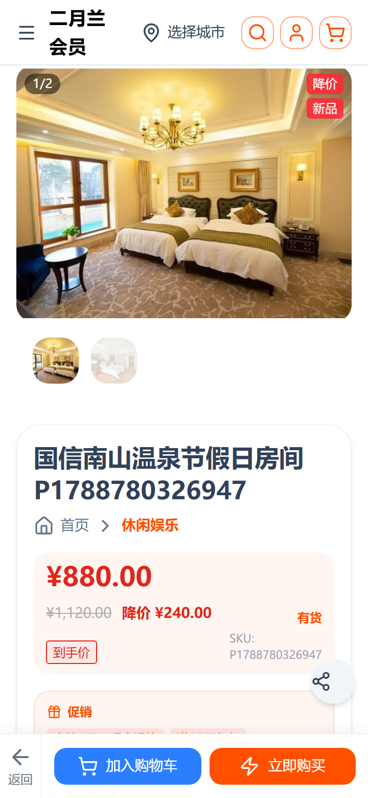

# 商品详情页六项修复 · 操作与验收手册

> 适用站点：C 端商城 www.youshop.cn（nshop）｜运营后台 e.joho.cn/guanli（web-admin）
> 本次修复覆盖：商品图片多图展示、促销/服务方案后台配置、就近库存城市兜底、营销标签角标、面包屑层级、底部导航栏。

---

## 目录

- [1. 六项修复一览](#1-六项修复一览)
- [2. 运营端操作：促销方案 / 服务保障配置](#2-运营端操作促销方案--服务保障配置)
- [3. 运营端操作：营销标签与商品图片](#3-运营端操作营销标签与商品图片)
- [4. C 端验收点（手机视口）](#4-c-端验收点手机视口)
- [5. 常见问题](#5-常见问题)

---

## 1. 六项修复一览

| # | 修复项 | 修复前 | 修复后 |
|---|--------|--------|--------|
| 1 | 商品图片 | 多图被裁切、无法滑动 | 缩略图条可横滑完整查看；大图显示 `n/m` 角标 |
| 2 | 促销/服务方案 | 前端写死文案 | 运营后台维护「方案库」，商品可多选覆盖，C 端按「商品→频道→i18n」回退 |
| 3 | 就近库存 | 无定位时不显示门店库存 | 无定位但有城市时按城市兜底查询；无城市才显示定位引导 |
| 4 | 营销标签 | 仅列表页有标签 | 详情页主图右上角以角标叠层显示；灯箱 caption 同步；12 语言包映射 |
| 5 | 面包屑 | 同级分类出现伪层级（休闲娱乐 > 特色） | 只取首个顶级分类：`首页 > 休闲娱乐 > 商品名` |
| 6 | 底部导航栏 | 四列导航挤压双按钮、文字换行变形 | 仅保留「返回 + 首页(宽屏) + 加入购物车 + 立即购买」，宽窄屏自适应 |

---

## 2. 运营端操作：促销方案 / 服务保障配置

### 2.1 第一步：维护频道方案库（店铺信息）

1. 登录运营后台 `e.joho.cn/guanli`，进入 **店铺信息**
2. 找到 **「促销方案库」** 卡片：每行填写 `code`、中文文案、英文文案
3. 点击 **「+ 添加方案」** 增加条目，不需要的条目点 **「删」** 移除
4. **「服务保障库」** 卡片同理
5. 点击 **「保存」**

> 方案库是**频道默认**：只要商品未单独勾选，C 端展示方案库全部文案。

```
┌────────────────────────────────────────────┐
│ 促销方案库（频道默认；商品可覆盖）           │
│ ┌──────────┬────────────┬────────────┐ ┐   │
│ │ freeShip99│ 满99元包邮  │Free ship 99│ │删 │
│ └──────────┴────────────┴────────────┘ ┘   │
│ [+ 添加方案]                                │
│ 服务保障库（频道默认；商品可覆盖）           │
│ ┌──────────┬────────────┬────────────┐ ┐   │
│ │ refund7   │7天无理由退换│7-day return│ │删 │
│ └──────────┴────────────┴────────────┘ ┘   │
│ [+ 添加方案]                                │
│                                [保存]      │
└────────────────────────────────────────────┘
```

### 2.2 第二步：商品选择促销/服务（商品编辑 → 品牌营销）

1. 进入 **商品管理 → 编辑商品**
2. 切换到 **「品牌营销」** Tab
3. **「促销方案」** 卡片：勾选该商品要展示的方案（来自方案库）
4. **「服务保障」** 卡片：勾选该商品要展示的保障
5. 保存商品

> 商品勾选后为**商品覆盖**：C 端只显示勾选项；若方案库为空，页面提示先去店铺信息配置。

```
┌────────────────────────────────────────────┐
│ 促销方案                                    │
│ ☑ 满99元包邮   ☐ 下单立减20   ☐ 买一送一     │
│ 服务保障                                    │
│ ☑ 7天无理由退换  ☑ 顺丰包邮   ☐ 极速退款     │
└────────────────────────────────────────────┘
```

### 2.3 C 端展示回退链

```
商品勾选（promos/services） → 频道方案库（promoSchemes/serviceSchemes） → i18n 默认文案
```

### 2.4 运营端截图



- 「促销方案库 / 服务保障库」卡片：每行填写 code + 中文 + 英文，`+ 添加方案` 增行，`删` 移除
- 未配置时商品侧显示「请先在店铺信息-促销方案库配置」空态引导



- 「促销方案 / 服务保障」多选：选项来自频道方案库，勾选即商品覆盖；不勾选则回退频道默认
- 「营销标签」：新品/热卖/特价/限时折扣/包邮/满减/清仓/有货 8 个可选

---

## 3. 运营端操作：营销标签与商品图片

### 3.1 营销标签

1. 商品编辑 → **「品牌营销」** Tab → **「营销标签」**
2. 勾选标签（新品/热卖/特价/限时折扣/包邮/满减/清仓/有货）
3. 保存后 C 端详情页主图右上角以**红色角标叠层**显示；点开大图（灯箱）caption 同步标签

> 12 种语言均已内置标签翻译，未知 code 会按原文兜底显示，不会报错。

### 3.2 商品图片

- 图片区显示 **「已关联 N 张」**，最多 9 张
- C 端缩略图条**可横向滑动**，点击切换大图；大图左上角显示 `n/m` 当前位置

---

## 4. C 端验收点（手机视口）

> 以下截图均为手机视口（390×844、dpr=2）实拍。

### 4.1 商品图片与营销标签角标


- 缩略图条可横滑、大图 `n/m` 角标
- 主图右上角营销标签角标（如「降价」「新品」）

### 4.2 促销/服务与就近库存



- 促销/服务条来自后台方案库配置
- **无定位、有城市**时按城市查询就近库存（不再出现「开启定位可查看就近库存」）

### 4.3 面包屑

- 面包屑 = `首页 > 休闲娱乐 > 商品名`（只取首个顶级分类，无伪层级）

### 4.4 底部导航栏

　

- 宽屏（≥375px）：返回 | 首页 | 加入购物车 | 立即购买
- 窄屏（<375px）：返回 | 加入购物车 | 立即购买（首页隐藏，双按钮不换行）

---

## 5. 常见问题

### Q1：C 端促销条没显示后台配的方案？

1. 确认「店铺信息」已保存方案库，且 **code 非空**
2. 确认商品「品牌营销」勾选的 code 与方案库 code 一致
3. 商品勾选了 code 就只显示勾选项——想恢复频道默认，取消全部勾选

### Q2：营销标签显示成了英文 code？

- 标签 code 不在 12 语言包翻译表内（按原文兜底）。请在语言包 `messages.detail.marketingTags` 补充该 code 的翻译，或用后台内置的 8 个标签 code

### Q3：就近库存提示「开启定位」？

- 说明当前**既无定位、也无已选城市**：在首页/定位组件手动选择城市后即按城市兜底查询

### Q4：底栏在窄屏变形？

- 窄屏（<375px）自动隐藏「首页」项，仅保留返回+双按钮；若仍变形，检查是否命中 `min-[375px]:flex` 断点

---

> **文档版本**：v1.0 ｜ **适用系统**：nshop（Nuxt 3）+ vendure + web-admin（uni-app）
> **更新日期**：2026-09-13 ｜ **截图**：手机视口 390×844 dpr=2
